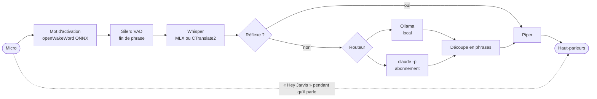

# Jarvis — assistant vocal local

Assistant vocal en français qui tourne **sur ta machine**, sous **macOS et Windows**.
Tu dis « Hey Jarvis », tu parles normalement, il répond à voix haute. Tu peux lui couper
la parole, et le faire réfléchir en local ou avec **ton abonnement Claude**.

> Réécriture de [sosoj92/jarvis-assistant-vocal](https://github.com/sosoj92/jarvis-assistant-vocal)
> (MIT), repartie de zéro pour corriger ses défauts : Windows uniquement, quasiment pas
> de tests, mode local lent et fragile. Le détail est dans [docs/ROADMAP.md](docs/ROADMAP.md).

**État : étapes 1 et 2 sur 6.** Le pipeline vocal local et le moteur Claude sont faits ;
les actions sur le PC arrivent à l'étape 3.

## Latence mesurée

MacBook Air M5 16 Go, modèles par défaut, `uv run jarvis bench` :

| Étage | Temps |
|---|---|
| Fin de ta phrase détectée (silence) | 550 ms, réglable |
| Transcription Whisper large-v3-turbo q4 (MLX) | ~350 ms |
| LLM `qwen3.5:4b-mlx` : premier token, puis première phrase complète | ~200 ms, ~690 ms |
| Voix Piper : premier son | ~55 ms |
| **Fin de ta phrase → première syllabe** | **~1,65 s** pour une question, **~0,96 s** pour l'heure ou la date |

Pour Claude : `uv run jarvis bench --backend claude`. Chaque étage est chronométré
séparément, sans micro.

## Ce qui rend la conversation fluide

- **Fin de phrase détectée par un réseau de neurones** (Silero VAD, avec hystérésis et
  pré-roll), pas par un seuil de volume ni un délai fixe.
- **Tout est chargé et chauffé au démarrage, en parallèle**, et reste en mémoire.
- **Réponse en flux** : la phrase part en synthèse dès qu'elle est complète, la voix
  commence pendant que le reste s'écrit. Le premier morceau part dès la première virgule.
- **Réflexes sans LLM** : heure, date, « stop », changement de moteur.
- **Réglages mesurés, pas devinés** : Whisper quantifié q4 (même texte que la version
  pleine, ~1 Go de mémoire en moins), variante `-mlx` d'Ollama sur Mac, pas de
  « réflexion » du modèle local, contexte court, prompt système stable pour le cache.
- **Coupure de parole** : l'écoute continue pendant qu'il parle ; « Hey Jarvis » le fait
  taire dans les 20 ms.
- **Choix automatique selon la machine** : Metal sur Apple Silicon, CUDA sur GPU NVIDIA,
  modèles réduits sur CPU seul (`uv run jarvis doctor` montre le plan choisi).

## Installation

### macOS (Apple Silicon)

```bash
brew install uv ollama
brew services start ollama
git clone https://github.com/sacha9214/jarvis-vocal.git
cd jarvis-vocal
uv sync
uv run jarvis setup
uv run jarvis
```

Au premier lancement, macOS demande l'accès au micro pour ton terminal : accepte.

### Windows 10/11

```powershell
winget install astral-sh.uv Ollama.Ollama
git clone https://github.com/sacha9214/jarvis-vocal.git
cd jarvis-vocal
uv sync                 # avec un GPU NVIDIA : uv sync --extra cuda
uv run jarvis setup
uv run jarvis
```

`jarvis setup` télécharge le LLM (~4 Go), Whisper (~0,5 Go), la voix (~60 Mo) et les
petits modèles d'écoute. Tous les fichiers audio sont vérifiés par empreinte SHA-256.

## Utiliser ton abonnement Claude

1. Installe [Claude Code](https://code.claude.com) et connecte-toi une fois, dans ton
   terminal : `claude auth login`.
2. Dis « Hey Jarvis, passe sur Claude ». Pour démarrer directement dessus, mets
   `llm.backend: claude` dans `config.yaml` ou lance `uv run jarvis run --backend claude`.

Comment c'est fait :

- **Dans les règles.** Jarvis lance le programme officiel `claude`, non modifié, et lit
  sa sortie. Il ne lit, ne stocke ni ne transmet jamais tes identifiants : la connexion
  passe par le flux d'Anthropic. C'est ce que la page *Legal and compliance* de Claude
  Code autorise ; réutiliser directement les jetons d'un abonnement dans une autre
  application est interdit.
- **Rapide.** Un seul processus `claude` reste ouvert pendant toute la session : le
  démarrage n'est payé qu'une fois. Modèle par défaut : `haiku`, le plus rapide à répondre.
- **Isolé.** Rien de ton `~/.claude` n'est chargé : ni CLAUDE.md, ni mémoire, ni hooks,
  ni plugins, ni connecteurs, ni outils. Le prompt reste minuscule, ton quota est
  épargné, et Claude ne peut rien exécuter sur ta machine.
- **Tolérant.** Si Claude échoue avant de répondre (hors ligne, limite atteinte,
  connexion expirée), Jarvis le dit et répond en local, puis reste en local jusqu'à ce
  que tu redemandes Claude.
- **Personnel.** Les limites d'un abonnement supposent un usage individuel ordinaire :
  c'est l'usage prévu ici.

## Commandes

| Commande | Rôle |
|---|---|
| `uv run jarvis` | lance l'assistant |
| `uv run jarvis setup` | télécharge les modèles adaptés à ta machine |
| `uv run jarvis doctor` | vérifie Ollama, Claude Code, les modèles, le micro et la sortie audio |
| `uv run jarvis bench` | mesure la latence de chaque étage (`--backend claude` pour Claude) |
| `uv run jarvis devices` | liste les périphériques audio |

| À la voix | Effet |
|---|---|
| « Hey Jarvis » | réveille Jarvis, ou lui coupe la parole |
| « passe sur Claude » / « passe en local » | change de moteur |
| « quel modèle tu utilises ? » | dit le moteur actif |
| « quelle heure est-il ? », « on est quel jour ? » | réponse instantanée |
| « stop » | le remet en veille |

Pour régler quoi que ce soit, copie `config.example.yaml` en `config.yaml` : chaque clé y
est commentée.

## Architecture



```
src/jarvis/
  audio/      micro, sortie, mot d'activation, VAD, capture d'une phrase
  stt/        Whisper : mlx (Apple Silicon), faster-whisper (CUDA/CPU)
  llm/        interface en flux, Ollama, Claude Code, routeur local/Claude avec repli
  tts/        Piper
  text/       découpe du flux du LLM en morceaux prononçables
  pipeline.py la boucle de conversation
  hardware.py détection de la machine → choix des modèles
  bench.py    doctor.py  assets.py  config.py
```

## Limites connues

- **Pas d'annulation d'écho** : sans casque, le micro entend Jarvis. Un garde-fou ignore
  ce qu'il vient de dire et la coupure passe par « Hey Jarvis », mais un casque reste le
  plus confortable.
- **Windows** : validé par la CI (installation, lint, tests) mais pas encore sur une
  vraie machine avec micro.
- **Pas encore d'actions** : Jarvis converse, mais n'agit pas encore sur le PC (étape 3).

## Développement

```bash
uv run pytest
uv run ruff check
```

La CI GitHub Actions lance les deux sur macOS et Windows à chaque push. Le moteur Claude
est testé contre un faux `claude` (`tests/fake_claude.py`) : aucun test ne consomme
d'abonnement.

Licence MIT.
