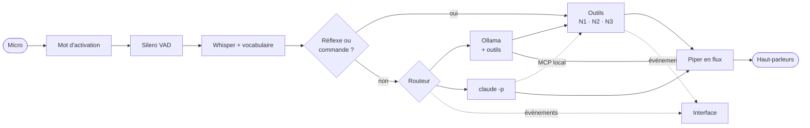

# Jarvis — assistant vocal local

Assistant vocal en français qui tourne **sur ta machine**, sous **macOS et Windows**.
Tu dis « Hey Jarvis », tu parles normalement, il répond à voix haute, **agit sur ton
ordinateur** (applications, musique, volume, minuteurs…) et s'affiche dans une **interface
holographique** où tu règles tout en direct. Il réfléchit en local ou avec **ton abonnement Claude**.

> Réécriture de [sosoj92/jarvis-assistant-vocal](https://github.com/sosoj92/jarvis-assistant-vocal)
> (MIT), repartie de zéro pour corriger ses défauts : Windows uniquement, quasiment pas
> de tests, mode local lent et fragile. Le détail est dans [docs/ROADMAP.md](docs/ROADMAP.md).

**État : étapes 1 à 3 faites** (pipeline vocal local, abonnement Claude, actions sur le PC)
**et l'interface**. Prochaine étape : les intégrations (agenda, domotique…).

## Latence mesurée

MacBook Air M5 16 Go, modèles par défaut, `uv run jarvis bench` :

| Étage | Temps |
|---|---|
| Fin de ta phrase détectée (silence) | 550 ms, réglable |
| Transcription Whisper large-v3-turbo q4 (MLX) | ~370 ms |
| LLM `qwen3.5:4b-mlx` : premier token, puis première phrase complète | ~200 ms, ~690 ms |
| Voix Piper : premier son | ~55 ms |
| **Fin de ta phrase → première syllabe** | **~1,65 s** pour une question, **~1 s** pour une commande (« ouvre Spotify ») |

Les commandes courantes sur le PC ne passent pas par le LLM : elles répondent aussi vite
que l'heure ou la date.

## Ce que Jarvis sait faire sur ton ordinateur

| Tu dis | Action | Niveau |
|---|---|---|
| « ouvre Spotify », « lance la calculatrice » | ouvre une application installée | N1 |
| « va sur YouTube », « cherche recette de crêpes » | ouvre un site, lance une recherche | N1 |
| « ouvre mes téléchargements » | ouvre un dossier | N1 |
| « monte le son », « volume à trente », « coupe le son » | volume | N1 |
| « mets pause », « chanson suivante » | lecture (Spotify, Musique ; lecteur actif sous Windows) | N1 |
| « mets un minuteur de 5 minutes pour les pâtes » | minuteur annoncé à voix haute | N1 |
| « donne-moi l'état de l'ordinateur » | batterie, processeur, mémoire | N1 |
| « ferme Discord », « verrouille l'écran » | fermeture, verrouillage | N2 |
| « éteins l'ordinateur », « redémarre le PC » | extinction après 20 s, « annule l'extinction » | N3 |

- **N1** agit tout de suite. **N2** demande « Tu confirmes ? » : réponds « oui », « non » ou
  « toujours » pour ne plus être interrogé. **N3** demande à chaque fois, sans exception.
- La confirmation se donne **à la voix ou d'un clic** dans l'interface.
- Les phrases courantes sont reconnues **sans LLM** (plus rapide, plus fiable) ; le reste part
  au modèle, qui dispose des **mêmes outils**, avec les mêmes confirmations.
- Avec Claude, les outils passent par un **serveur MCP local** : Claude n'a accès à aucun de
  ses outils intégrés (ni terminal, ni fichiers), seulement aux actions de Jarvis.
- Chaque action peut être désactivée dans l'interface (onglet Permissions).

## L'interface

- Réacteur animé qui réagit à ta voix et à celle de Jarvis, avec une couleur par état :
  veille, écoute, réflexion, parole, confirmation.
- Journal en direct : ce que tu as dit, ce que Jarvis a répondu, chaque action avec son
  niveau et sa durée.
- Système (processeur, mémoire, batterie), minuteurs en cours, latence du dernier échange.
- Boutons **Parler** (sans « Hey Jarvis »), **Stop**, bascule **Local / Claude**.
- **Réglages** : prénom, moteur, sensibilité du micro, silence de fin de phrase, débit de la
  voix, modèles, permissions. Chaque réglage indique s'il s'applique **en direct** ou au
  **redémarrage** ; l'enregistrement écrit `config.yaml` et un bouton relance Jarvis si besoin.
- Raccourcis : `Espace` parler, `S` stop, `Entrée` / `Échap` pour confirmer ou refuser.

Elle s'ouvre dans une fenêtre native (WebKit sur macOS, WebView2 sous Windows). Le serveur
n'écoute que ta machine (127.0.0.1), refuse les autres noms d'hôte et exige le jeton aléatoire
de la session. Aperçu sans charger les modèles : `uv run jarvis hud`.

## Compréhension de la voix

- **Vocabulaire** : Whisper reçoit les noms de tes applications et les commandes courantes. Sur
  48 commandes enregistrées par des voix de synthèse, les bonnes commandes passent de **15 à 26**
  (11 sur 12 avec la voix la plus naturelle), pour ~20 ms de plus.
- **Garde-fous** : si le vocabulaire fait dérailler Whisper (boucle, phrase fantôme), la phrase est
  retranscrite aussitôt sans lui ; la longueur d'une transcription est plafonnée.
- **Noms mal entendus** : la recherche d'application compare aussi la prononciation
  (« Spotifaille » → Spotify, « Discorde » → Discord).
- **Hésitations** : « Ouvre… euh… » ne part pas tout de suite, Jarvis attend la fin de la phrase.
- **Micro faible** : le signal est amplifié avant la transcription.

## Installation

### macOS (Apple Silicon)

```bash
brew install uv ollama
brew services start ollama
git clone https://github.com/sacha9214/jarvis-vocal.git
cd jarvis-vocal
uv sync
uv run jarvis setup
uv run jarvis
```

Au premier lancement, macOS demande l'accès au micro pour ton terminal, puis l'autorisation
de piloter Spotify ou Musique la première fois que tu dis « mets pause » : accepte.

### Windows 10/11

```powershell
winget install astral-sh.uv Ollama.Ollama
git clone https://github.com/sacha9214/jarvis-vocal.git
cd jarvis-vocal
uv sync                 # avec un GPU NVIDIA : uv sync --extra cuda
uv run jarvis setup
uv run jarvis
```

`jarvis setup` télécharge le LLM (~4 Go), Whisper (~0,5 Go), la voix (~60 Mo) et les
petits modèles d'écoute. Tous les fichiers audio sont vérifiés par empreinte SHA-256.

## Utiliser ton abonnement Claude

1. Installe [Claude Code](https://code.claude.com) et connecte-toi une fois, dans ton
   terminal : `claude auth login`.
2. Dis « Hey Jarvis, passe sur Claude », clique sur **CLAUDE** dans l'interface, ou mets
   `llm.backend: claude` dans les réglages.

- **Dans les règles.** Jarvis lance le programme officiel `claude`, non modifié, et lit
  sa sortie. Il ne lit, ne stocke ni ne transmet jamais tes identifiants : la connexion
  passe par le flux d'Anthropic, comme le prévoit la page *Legal and compliance* de Claude
  Code. Réutiliser directement les jetons d'un abonnement dans une autre application est interdit.
- **Rapide.** Un seul processus `claude` reste ouvert pendant toute la session. Modèle par
  défaut : `haiku`, le plus rapide à répondre.
- **Isolé.** Rien de ton `~/.claude` n'est chargé : ni CLAUDE.md, ni mémoire, ni hooks, ni
  plugins, ni connecteurs, ni outils intégrés.
- **Tolérant.** Si Claude échoue avant de répondre (hors ligne, limite atteinte, connexion
  expirée), Jarvis le dit et répond en local.
- **Personnel.** Les limites d'un abonnement supposent un usage individuel ordinaire.

## Commandes

| Commande | Rôle |
|---|---|
| `uv run jarvis` | lance l'assistant et son interface (`--ui browser` ou `--ui none` au besoin) |
| `uv run jarvis hud` | aperçu de l'interface avec des données simulées |
| `uv run jarvis setup` | télécharge les modèles adaptés à ta machine |
| `uv run jarvis doctor` | vérifie Ollama, Claude Code, les modèles, le micro et la sortie audio |
| `uv run jarvis bench` | mesure la latence de chaque étage (`--backend claude` pour Claude) |
| `uv run jarvis devices` | liste les périphériques audio |

| À la voix | Effet |
|---|---|
| « Hey Jarvis » | réveille Jarvis, ou lui coupe la parole |
| « passe sur Claude » / « passe en local » | change de moteur |
| « quel modèle tu utilises ? » | dit le moteur actif |
| « quelle heure est-il ? », « on est quel jour ? » | réponse instantanée |
| « stop » | le remet en veille |

## Architecture



```
src/jarvis/
  audio/      micro, sortie, mot d'activation, VAD, capture d'une phrase
  stt/        Whisper (mlx, faster-whisper), vocabulaire et garde-fous
  llm/        Ollama, Claude Code, routeur local/Claude avec repli
  tools/      registre des actions, permissions N1/N2/N3, serveur MCP
  system/     applications, volume, lecture, dossiers, alimentation (macOS + Windows)
  ui/         interface : page, API des réglages, fenêtre native
  commands.py commandes vocales reconnues sans LLM
  pipeline.py la boucle de conversation
  server.py   serveur local (127.0.0.1, jeton de session)
```

## Limites connues

- **Pas d'annulation d'écho** : sans casque, le micro entend Jarvis. Un garde-fou ignore
  ce qu'il vient de dire et la coupure passe par « Hey Jarvis », mais un casque reste le plus confortable.
- **Windows** : validé par la CI (installation, lint, tests) mais pas encore sur une vraie
  machine avec micro. Le volume y est réglé par touches virtuelles (pas de 2 %).
- **Verrouillage sur macOS** : met l'écran en veille ; il ne verrouille que si ton Mac demande
  le mot de passe immédiatement.
- **Voix de test** : les mesures de compréhension utilisent des voix de synthèse, plus dures à
  transcrire qu'une vraie voix. Les chiffres réels seront meilleurs, mais restent à mesurer.

## Développement

```bash
uv run pytest
uv run ruff check
```

La CI GitHub Actions lance les deux sur macOS et Windows à chaque push. Le moteur Claude
est testé contre un faux `claude` (`tests/fake_claude.py`) : aucun test ne consomme
d'abonnement ni n'agit sur l'ordinateur.

Licence MIT.
