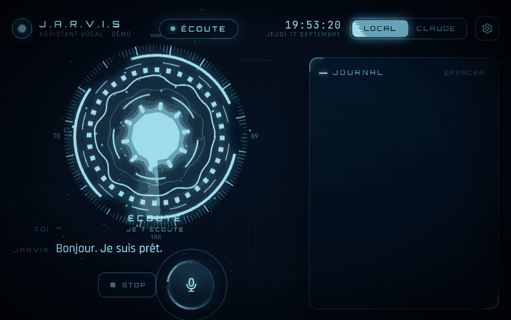

# Jarvis — local voice assistant

A French-speaking voice assistant that runs **on your own machine**, on **macOS and Windows**.
You say "Hey Jarvis", talk normally, and it answers in a **natural voice**, **acts on your
computer** (apps, music, volume, timers…), **controls videos and pages in your
browser**, **sees what you're doing on screen** and
shows up in a **holographic interface** where you adjust everything live. It thinks locally
or through **your Claude subscription**.

<p align="center">
  
</p>

<p align="center"><em>The real interface, running in preview mode (<code>jarvis hud</code>) on scripted
events: two spoken commands, the tools they fire, the confirmation Jarvis asks for before
closing an app, and the measured latency of each stage.</em></p>

> Jarvis understands and speaks French, so the example commands below are shown in French,
> exactly as you would say them.

> A rewrite of [sosoj92/jarvis-assistant-vocal](https://github.com/sosoj92/jarvis-assistant-vocal)
> (MIT), started from scratch to fix its shortcomings: Windows only, almost no
> tests, slow and fragile local mode. Details in [docs/ROADMAP.md](docs/ROADMAP.md).

## Measured latency

MacBook Air M5 16 GB, default models, `uv run jarvis bench`:

| Stage | Time |
|---|---|
| End of your sentence detected (silence) | 550 ms, adjustable |
| Whisper large-v3-turbo q4 transcription (MLX) | ~370 ms (~550 ms when memory is saturated) |
| LLM `qwen3.5:4b-mlx`: first token, then first complete sentence | ~200 ms, ~550-850 ms |
| Pocket TTS natural voice: first sound | ~150-250 ms (Piper: ~55 ms) |
| **End of your sentence → first syllable** | **~1.7-2 s** for a question, **~1-1.5 s** for a command |

What Jarvis uses meanwhile, measured on the same Mac:

| Resource | Value |
|---|---|
| Jarvis memory (listening, transcription, voice) | 2.6 GB |
| Local model memory, in Ollama | 4.7 GB |
| CPU while idle | 7 to 8% of one core |
| CPU while Jarvis speaks | about 1.5 cores |
| Transcribing 3 seconds of speech | 380 ms |

Common computer commands don't go through the LLM: they respond as fast
as asking for the time or date.

## Natural voice

Jarvis speaks with [Pocket TTS](https://github.com/kyutai-labs/pocket-tts) (Kyutai, MIT), a
neural French voice far more human than Piper. It runs on the CPU, streaming,
without slowing down Whisper or the LLM on the GPU.

- **Default voice: Fantine.** Measured on 16 typical short replies, it renders 14 to 15
  correctly; the male voices (Marius, Jean, Javert) drop to 2 or 3 on this kind of sentence.
  They can still be selected, flagged as unstable.
- The voice changes **instantly** from the interface. `tts.voice` also accepts a `.wav`
  file to imitate.
- Safeguards: if the machine is too slow to speak without stuttering, Jarvis keeps **Piper**; if a
  generation runs away, it is cut off.
- **Never fewer than three words.** Measured (synthesis, then transcription back by Whisper, 64 runs per
  variant): Fantine garbles ~40% of one- or two-word utterances ("Pause." becomes "Pose", "Oui."
  becomes a breath), and 2% from three words up. A lead-in word doesn't help. So every Jarvis sentence
  has at least three words, and the splitter glues a chunk that's too short onto the next one. The
  sound card was not to blame: zero underruns measured, even at low latency with Ollama
  generating at the same time.

## What Jarvis can do on your computer

| You say | Action | Level |
|---|---|---|
| « ouvre Spotify », « lance la calculatrice » | opens an installed app | N1 |
| « va sur YouTube », « cherche recette de crêpes » | opens a website, runs a search | N1 |
| « ouvre mes téléchargements » | opens a folder | N1 |
| « monte le son », « volume à trente », « coupe le son » | volume | N1 |
| « mets pause », « chanson suivante » | playback (Spotify, Music; active player on Windows) | N1 |
| « mets un minuteur de 5 minutes pour les pâtes » | timer announced out loud | N1 |
| « baisse le volume de la vidéo », « avance de 30 secondes » | browser video | N1 |
| « lance la deuxième vidéo », « clique sur Paramètres » | clicks in the page | N1 |
| « cherche des tutos Python sur YouTube », « ferme l'onglet » | search, tabs | N1 / N2 |
| « résume ce document », « clique sur Envoyer », « enregistre le fichier » | reads and controls the open app | N1 / N2 |
| « c'est quoi cette erreur ? », « explique cette fonction », « va à la ligne 42 » | reads and controls VS Code (extension) | N1 |
| « écris un commentaire ici », « lance les tests » | writes in the file, runs | N2 |
| « fais une review de mon code », « relis mes changements avec Claude » | code review in the background | N1 |
| « qu'est-ce que tu vois ? », « c'est quoi cette erreur ? » | looks at the screen and answers | N1 |
| « donne-moi l'état de l'ordinateur » | battery, CPU, memory | N1 |
| « cherche le fichier rapport », « trouve mon CV », « ouvre le fichier contrat » | finds and opens a file | N1 |
| « qu'est-ce qui est ouvert ? », « passe sur Discord » | lists windows, switches apps | N1 |
| « réduis la fenêtre », « plein écran », « mets la fenêtre à gauche » | manages the front window | N1 |
| « qu'est-ce que j'ai copié ? », « copie ce texte » | clipboard | N1 |
| « monte la luminosité », « à quel réseau je suis connecté ? » | display, Wi-Fi, Bluetooth | N1 |
| « prends une capture » | screenshot saved to the desktop | N1 |
| « combien font 15 pour cent de 340 ? » | exact math, without going through the model | N1 |
| « combien de place libre ? », « crée un dossier Photos » | disk, folders | N1 |
| « ferme Discord », « verrouille l'écran » | quit, lock | N2 |
| « éteins l'ordinateur dans 25 minutes », « redémarre le PC » | delayed shutdown, cancellable at any time | N3 |

- **Delayed shutdown**: « éteins l'ordinateur dans 25 minutes », « redémarre le pc dans une heure »,
  « mets l'ordinateur en veille dans 20 minutes ». Jarvis confirms, announces the time, **warns you one
  minute before**, and « annule l'extinction » stops everything. « Il reste combien de temps ? » gives the
  countdown. With no delay, it waits 20 seconds, giving you time to change your mind.
- **N1** acts right away. **N2** asks « Tu confirmes ? » (do you confirm?): answer « oui », « non » or
  « toujours » (always) to never be asked again. **N3** asks every time, no exceptions.
- Confirmation is given **by voice or with a click** in the interface.
- Common phrases are recognized **without the LLM**; everything else goes to the model, which has the
  **same tools**, with the same confirmations.
- With Claude, tools go through a **local MCP server**: Claude has no access to any of
  its built-in tools (no terminal, no files), only to Jarvis's actions.

## Memory

Jarvis remembers what you teach it, from one session to the next:

| You say | Effect |
|---|---|
| « retiens que je travaille sur le projet jarvis-vocal » | remembered for good |
| « souviens-toi que ma sœur s'appelle Léa » | same |
| « qu'est-ce que tu sais sur moi ? » | recites what it remembers |
| « oublie que je préfère le café sans sucre » | removes the closest memory |
| « oublie tout » | wipes the memory |

Then « comment s'appelle ma sœur ? » (what's my sister's name?) answers "Léa", without you repeating it.

- **Only the memories relevant to the question are given to the model**, right before it. Measured on eight
  questions: with the whole memory in the prompt, a 4-billion-parameter model recited it
  anywhere ("The capital of Italy is Rome. I prefer my coffee without sugar"), 6 correct answers
  out of 8; giving only the relevant memories, 8 out of 8.
- Memories are presented to it **in the third person** ("Sacha is working on…"): read as-is,
  "I'm working on jarvis" made it say "I'm working on Jarvis", as if it were talking
  about itself.
- The system prompt doesn't change when the memory does: the model's cache stays valid.
- **Nothing secret is stored**: passwords, codes, card numbers or keys are refused.
- Forty memories at most; the oldest makes room. Everything lives in `memory.json` in the data
  folder, readable and editable; a corrupted file is set aside, never overwritten.

## Calendar

| You say | Effect |
|---|---|
| « qu'est-ce que j'ai demain ? », « …de prévu jeudi ? » | the day's schedule |
| « qu'est-ce que j'ai cette semaine ? » | the next seven days |
| « c'est quoi mon prochain rendez-vous ? » | the next one, with the day |
| « est-ce que je suis libre demain à 15 heures ? » | free, or what occupies that slot |
| « ajoute rendez-vous chez le dentiste jeudi à 14 heures » | adds it to Jarvis's calendar |
| « je dois voir le dentiste vendredi à 11 heures, tu peux le noter ? » | same, with the request at the end |
| « supprime le rendez-vous chez le dentiste » | removes it |

- **Spoken reminder ten minutes before** each appointment (`agenda.remind_minutes`, 0 for none).
- **Your Google, Outlook or iCloud calendars are read**, without signing in to your account or any password: paste
  their private iCal address into `config.yaml`. Google: Settings › your calendar › "Secret address in
  iCal format"; Outlook: Settings › Calendar › Shared calendars › Publish; iCloud: share
  the calendar as a "Public Calendar".

```yaml
agenda:
  sources:
    - https://calendar.google.com/calendar/ical/…/private-…/basic.ics
  remind_minutes: 10
```

- Time zones, UTC times, **recurrences and their exceptions**, all-day events: handled
  by `icalendar` and `recurring-ical-events`, verified against a Google-format export.
- External calendars are **read-only**: a Google appointment is removed in Google. When
  offline, Jarvis keeps the last version it read.
- **The iCal address grants access to your calendar**: it never appears in the log (only the host
  does) and is never sent to the model.

## Automations

Jarvis acts on its own, at a given time or when something happens:

| You say | Effect |
|---|---|
| « tous les jours à 8 heures, rappelle-moi de prendre mes médicaments » | daily reminder |
| « chaque lundi à 9 heures, dis-moi de faire le point » | weekly reminder |
| « en semaine à 18 heures 30, ferme Discord » | command Monday to Friday |
| « demain à 7 heures, rappelle-moi d'appeler le garage » | one time only |
| « ce soir à 8 heures, rappelle-moi d'appeler maman » | 8 pm, one time only |
| « quand j'ouvre Spotify, mets le volume à 40 » | when an app opens |
| « quelles sont mes automatisations ? » | recites them |
| « supprime le rappel des médicaments » | removes the closest one |

- The action is either a reminder (« rappelle-moi de… », « dis-moi de… ») or **any command
  Jarvis understands**, played as if you had said it. Anything it wouldn't understand is rejected at
  creation time, not discovered at 8 in the morning.
- **Sensitive actions keep their confirmation**: scheduling « éteins l'ordinateur » won't shut it
  down without your yes.
- Recognized without the LLM, **with or without a comma**: Whisper doesn't always transcribe it, so Jarvis
  works out where "when" ends and "what" begins.
- Computer asleep at the scheduled time: caught up to ten minutes later, dropped beyond that. Never
  twice for the same occurrence, even after a restart.
- Machine events in `config.yaml` (`jarvis doctor` validates them):

```yaml
automations:
  - name: batterie
    when: {event: battery_low}          # also startup, power_plugged, power_unplugged, app_opened
    say: "La batterie est presque vide, branche le chargeur."
  - name: coucher
    when: {time: "23:00", days: [lundi, mardi, mercredi, jeudi, vendredi]}
    do: "mets l'ordinateur en veille"
```

## Machine control

Beyond apps and sound, Jarvis controls the computer itself. Everything works on **macOS and
Windows**, and the Windows side is verified on every push by CI, which runs these tests on a
real Windows machine.

| Area | What you can say |
|---|---|
| **Files** | « cherche le fichier rapport », « trouve mon CV », « trouve mes photos de vacances », « ouvre le fichier contrat », « ouvre le deuxième », « montre où est le contrat », « crée un dossier Vacances », « combien de place libre ? » |
| **Windows** | « qu'est-ce qui est ouvert ? », « passe sur Discord », « réduis la fenêtre », « plein écran », « ferme la fenêtre », « mets la fenêtre à gauche » |
| **Clipboard** | « qu'est-ce que j'ai copié ? », « copie rendez-vous à 15 h » |
| **Settings** | « monte la luminosité », « luminosité à 50 », « à quel réseau je suis connecté ? », « coupe le Wi-Fi », « état du Bluetooth » |
| **Screenshot** | « prends une capture », « prends une capture d'une zone » |
| **Math** | « combien font 15 pour cent de 340 ? », « racine carrée de 144 », « 1250 divisé par 5 » |

- **File search** uses the system index, the one behind the search icon: Spotlight on macOS,
  Windows Search on Windows. Without an index, Jarvis scans your personal folders for four
  seconds at most, rather than crawling the whole disk.
- **It also searches file contents**: « cherche le document qui parle de la facture EDF », « trouve
  les fichiers qui contiennent mot de passe wifi », « cherche contrat dans mes fichiers ». And when no
  file name matches, Jarvis looks through the text on its own. Measured on a Mac: 104 ms through the index. Without
  an index, it reads text files itself (notes, Markdown, CSV, code…) in 2.4 s; PDFs and
  Word documents can then only be searched if the system index knows them.
- When several files share the same name, it numbers them: « ouvre le deuxième » (open the second one) is enough.
- **Moving to the trash** stays recoverable and is never a permanent deletion.
- **Math is exact**: it doesn't go through the model, which gets numbers wrong. The expression
  is parsed then evaluated operation by operation, never executed as code.
- All these phrases are recognized **without the LLM**, so they're instant. The model has the same tools for
  free-form wording.

## Browser

Jarvis controls the video and the page in your browser: video volume (independent of the
computer's volume), pause, seek, speed, next video, picking a video, clicking a button or a
link, scrolling, tabs, YouTube or Google search. For a free-form request (« mets la vidéo de
cuisine »), the model **reads the page first**, then clicks.

It **also fills in forms**. Page reading numbers the input fields with their name and
what they already contain, alongside links and buttons:

```
2. [champ] Titre
3. [champ] Description (contient : ma première version)
6. [bouton] Publier
```

- « écris ma description dans le champ Description », « tape chat mignon dans Rechercher »: recognized
  **without the LLM**; the field is targeted by its name (label, `aria-label`, placeholder or `name`).
- Without a field name, Jarvis types into the focused one; it can also focus it
  itself (« clique sur Description »).
- By default the text is **appended** to the field's content; the model can ask to replace it.
- Verified in a real Firefox on all four kinds of fields: `input`, `textarea`, placeholder-only
  field, and `contenteditable` area.

| Browser | How |
|---|---|
| Chrome, Edge, Brave, Opera, Vivaldi, Arc | Jarvis extension: `uv run jarvis extension`, then "Load unpacked" |
| Firefox | the same extension, as a temporary add-on (reload it after each Firefox restart); clicking the Jarvis icon grants site access, which Firefox doesn't give at install time |
| Safari (macOS) | no extension, through AppleScript: enable "Allow JavaScript from Apple Events" |

- `jarvis extension` shows the steps and opens the folder to load.
- Jarvis acts on the **last browser used**: clicking in its window to talk to it doesn't
  change the target.
- **Security**: the bridge only listens on 127.0.0.1, only accepts extensions (a web page can't
  connect to it) and requires a token unique to your machine. Jarvis **refuses to click** buy,
  pay, delete, send, publish, subscribe…; closing a tab or typing text asks for confirmation.

## Any application

Outside the browser, Jarvis reads and controls the app you're using — Word, Outlook, Discord,
File Explorer, Settings, your editor — through the **system accessibility layer**, the one screen readers use:
« résume ce document », « c'est quoi ce message ? », « clique sur Envoyer », « appuie sur contrôle S ».

| System | How | Permission needed |
|---|---|---|
| Windows 10/11 | UI Automation | none |
| macOS | Accessibility API (AX) | System Settings › Privacy & Security › Accessibility, for your terminal |

- Jarvis **reads first** (title, visible text, numbered buttons and menus), then clicks by number or by name.
- Elements are activated **without moving the mouse** when the system allows it.
- The content of **password fields is never read**.
- Same safeguards as in the browser: Jarvis refuses buy, pay, delete, send, publish… and
  also refuses a "Yes" in a dialog that talks about deleting. Typing text and sending a shortcut
  ask for confirmation (N2).
- "Control S" becomes **Cmd+S** on a Mac: that's what someone coming from Windows means.

## Code editor (VS Code)

VS Code draws its editor in a canvas and **exposes nothing to accessibility** (measured: 12 elements,
0 characters, even with `editor.accessibilitySupport`). So Jarvis uses a **VS Code extension**,
modeled on the browser one: `uv run jarvis code` packages it (VSIX, without Node or vsce) and
installs it in VS Code, Cursor, Windsurf or VSCodium; "Jarvis" shows up in the status bar.

| You say | What Jarvis does |
|---|---|
| « explique ce fichier », « résume ce que j'ai sélectionné » | reads the file around the cursor (numbered lines), the selection, the tabs |
| « c'est quoi cette erreur ? », « il reste des problèmes ? » | reads the diagnostics (linter, compiler) for the file or the project |
| « ouvre pipeline point py », « va à la ligne 42 », « passe au deuxième onglet » | opens, jumps, switches tabs |
| « enregistre », « formate le fichier », « commente la ligne », « va à la définition » | ~40 safe editor commands |
| « cherche foreground dans le projet » | search across all files |
| « écris `pass` ici », « lance les tests » | writes at the cursor / replaces the selection, runs (N2: confirmation) |

- Common actions (save, format, go to line, open a file, tabs, tests) are
  recognized **without the LLM**.
- **Code review** uses the actual open file and the actual project folder provided by the extension,
  no more guessing from the window title.
- **Security**: same local bridge as the browser (127.0.0.1, port 47831, token unique to your machine),
  with an `/editor` route reserved for clients **without an Origin header**: a browser always sends one,
  so a web page can't impersonate the editor. The extension ships no secret; it
  reads the token from disk. No free-form command IDs: the model picks from a closed
  list, with no terminal access (`sendSequence`), no push, no deletion.
- Measured in an isolated VS Code: each action responds in **1 to 65 ms**.

## Code review

« Fais une review de mon code », « review de mes changements avec Claude », « relis ce fichier »,
« fais la review du projet site vitrine »: Jarvis runs it **in the background**, tells you so, and reads
you the summary when it's done. The full report appears in the interface log and as markdown
in the data folder (`reviews/`).

- **Which project**: the one in your VS Code, Cursor, Windsurf or VSCodium window (window title and editor
  history), recent JetBrains IDE projects, or the folder you name (searched in Desktop,
  Documents, `dev`, `projects`, `source\repos`, OneDrive…).
- **What**: depending on your sentence, the whole project, your **uncommitted changes** (git) or the **file on screen**.
- **With Claude** (default when Claude is the active engine, `sonnet` model): Claude explores the project
  **read-only** (read, search, list; no terminal, no writes), launched outside the project so that
  its settings and MCP servers don't load. If Claude fails, Jarvis falls back to local and says so.
- **Locally**: review in passes (the small model's context is short), paused during your
  conversations, 120 KB of code at most (adjustable); the report flags a partial review.
- « Où en est la review ? » (how's the review going?), « annule la review » (cancel the review).

## Screen analysis

Jarvis understands what you're doing: every ~20 s, and only if the screen has
changed, a downscaled screenshot is described in one sentence by the **local vision model**
("Sacha is coding in Python in Visual Studio Code"). That sentence goes along with your questions, including
to Claude; the image itself never leaves the machine and is never written to disk.

- Analysis **pauses during conversations** so it never slows down a reply.
- « C'est quoi cette erreur ? » (what's this error?) triggers an **immediate look** with your question.
- **Activity** panel in the interface; **Screen** tab to turn it off, set its frequency
  and the capture resolution.
- macOS asks for "Screen Recording" permission for your terminal on first use.

## The interface

- An animated reactor that responds to your voice and Jarvis's, with one color per state:
  idle, listening, thinking, speaking, confirming.
- Live log: what you said, what Jarvis answered, each action with its
  level and duration.
- System stats (CPU, memory, battery), on-screen activity, timers, latency of the last exchange.
- **Talk** button (no "Hey Jarvis" needed), **Stop**, **Local / Claude** toggle.
- **Settings**: first name, engine, microphone, end-of-sentence silence, voice, screen, models, permissions.
  Each setting says whether it applies **live** or on **restart**; saving
  writes `config.yaml` and a button restarts Jarvis if needed.
- Shortcuts: `Space` to talk, `S` to stop, `Enter` / `Esc` to confirm or decline.

It opens in a native window (WebKit on macOS, WebView2 on Windows). The server
only listens on your machine (127.0.0.1), rejects other host names and requires the session's random
token. Preview without loading the models: `uv run jarvis hud`.

## Wake word

Default sensitivity **0.25**, chosen by measurement: 25 recordings of "Hey Jarvis" (four voices,
several phrasings) against five minutes of French speech and noise.

| Situation | Threshold 0.5 (before) | Threshold 0.25 |
|---|---|---|
| Quiet | 96% | 100% |
| Moderate background noise | 73% | 96% |
| Loud background noise | 48% | 83% |
| While Jarvis is speaking (interrupting it) | 64% | 80% |
| False wake-ups (5 min of speech and noise) | 0 | 0 |

- **Just saying "Jarvis" is enough**: the model recognizes it just as well.
- **Keyboard shortcut Ctrl+Alt+J** (configurable, or empty for none): wakes Jarvis without speaking, and
  interrupts it if it's talking. Windows registers it without permission; macOS asks for "Input Monitoring"
  on first launch. A shortcut already taken by another app is reported.
- When Jarvis half-recognizes the word, it writes it in the log and in the interface
  ("I think I heard… score 0.18"): enough to tune the sensitivity instead of repeating yourself in vain.
- **Volume plays no role**: measured, the score is identical from 0 to −30 dB. Speaking louder doesn't
  help; moving away from the noise does.
- The 80 ms analysis step isn't adjustable: refining it to 40 ms makes detection *drop* from 73 to
  23% in noise, because the classifier's 16 embeddings no longer cover the length of the word.

### Changing the word ("Hey Friday", "Salut Karl"…)

Settings → Listening → **Wake word** (or `wakeword.phrase` in `config.yaml`), then restart.
The dedicated model only knows "Jarvis"; any other word is recognized differently: the voice detector
spots a short phrase followed by silence, Whisper transcribes it knowing which word to expect, and it
must be the word alone, greeting included. **It's less reliable than "Hey Jarvis"**, measured on synthetic voices:

| Measure | Result |
|---|---|
| Wake-ups, 40 calls (5 words, 4 voices) | 52% ("Hey Friday" 8/8, "Hey Nova" 6/8; "Ok Maison" 0/8, inaudible even without a lead-in) |
| False wake-ups, 60 similar phrases ("Salut Carole", "La maison"…) | 2 |
| End to end (real voice detector): wake-ups / false wake-ups | 6/9 · 0/21 |
| Cost of a short phrase being heard (Mac M3) | ~360 ms of Whisper; long sentences are ignored |

- **Pause briefly after the word**: "Hey Friday, ouvre Spotify" said in one breath is a sentence, not a call.
- Prefer a **distinctive two-syllable name**; at least 4 letters, 3 words at most (otherwise rejected).
- Switching back to "Hey Jarvis" returns to the dedicated model. Jarvis keeps its name in its replies.
- Not measured on Windows (faster-whisper on CPU): each short phrase will cost more there.

## Speech understanding

- **Vocabulary**: Whisper is given the names of your apps and common commands. On
  48 commands recorded with synthetic voices, correct commands go from **15 to 26**.
- **Safeguards**: if the vocabulary derails Whisper (loop, phantom sentence), the phrase is
  transcribed again right away without it; transcription length is capped.
- **Misheard names**: app search also compares pronunciation
  (« Spotifaille » → Spotify).
- **Hesitations**: « Ouvre… euh… » doesn't fire right away; Jarvis waits for the end of the sentence.

## Installation

### macOS (Apple Silicon)

```bash
brew install uv ollama
brew services start ollama
git clone https://github.com/sacha9214/jarvis-vocal.git
cd jarvis-vocal
uv sync
uv run jarvis setup
uv run jarvis
```

On first launch, macOS asks for access to the microphone, screen recording and
control of Spotify or Music: accept.

### Windows 10/11

```powershell
winget install astral-sh.uv Ollama.Ollama
git clone https://github.com/sacha9214/jarvis-vocal.git
cd jarvis-vocal
uv sync                 # with an NVIDIA GPU: uv sync --extra cuda
uv run jarvis setup
uv run jarvis
```

Update everything at once:

```powershell
winget upgrade --id Ollama.Ollama; winget upgrade --id astral-sh.uv; git pull; uv sync; claude update
```

`jarvis setup` downloads the LLM (~4 GB), Whisper (~0.5 GB), the voices (~1.3 GB) and the small
listening models. The listening models and the Piper voice are verified by SHA-256 hash.

**Ollama must be running** for local mode and screen analysis (Ollama app, or
`brew services start ollama` on a Mac). Claude mode, the voice and the interface work without it.

## LLM on another machine on the network

The local model can run on another computer (a PC with a good graphics card, for
example): Jarvis talks to it over the network, while the microphone, voice and screenshots stay here.

1. On the machine hosting the model: `ollama pull qwen3.5:9b`, then make Ollama listen on the
   network with the environment variable `OLLAMA_HOST=0.0.0.0` (Windows: in the environment
   variables, then restart Ollama; macOS: `launchctl setenv OLLAMA_HOST 0.0.0.0` and restart
   the app) and open port 11434 in its firewall.
2. Here, in the settings ("Ollama server") or in `config.yaml`:

```yaml
llm:
  host: http://192.168.1.20:11434
  model: auto          # picks the largest qwen3.5 on the server; or a specific name
```

- `jarvis doctor` tells you whether the server responds and which model is chosen; a missing model is reported
  along with the list of models available there.
- **Screenshots don't go over the network**: screen analysis keeps using this
  machine's Ollama. To send it to the remote server too, put its address in `screen.host` (setting
  "Ollama server for the screen"), knowingly.
- Local code review and questions go through the remote server: it's just text.

## Custom commands

Your phrases, your actions, in `config.yaml` (`jarvis doctor` validates the section):

```yaml
commands:
  - name: projet jarvis
    say: ["ouvre mon projet", "lance le projet jarvis"]
    run: code ~/Desktop/jarvis-vocal
  - name: note
    say: ["note *", "prends note de *"]
    run: echo "{text}" >> ~/Desktop/notes.txt
    reply: "C'est noté, {text}."
  - name: réunion
    say: ["lance la réunion"]
    open: https://meet.google.com/abc-defg-hij
  - name: capture
    say: ["fais une capture"]
    keys: ctrl+shift+4
    confirm: true
  - name: thé
    say: ["lance le thé"]
    tool: set_timer
    args: { seconds: 180, label: thé }
```

- One action per command: `run` (command line, run from your home folder), `open`
  (web address, file or folder), `keys` (shortcut in the foreground app) or `tool`
  (a Jarvis action, with `args`).
- `*` in a phrase captures what you say at that point, available as `{text}` in `run`, `open`,
  `args` and `reply` (quotes and `$` are stripped before reaching the shell).
- `confirm: true` asks for confirmation (N2, can be remembered with « toujours »); `speak_output: true`
  reads the command's output aloud (20 s maximum).
- Phrases are recognized **without the LLM**, ignoring accents and punctuation. The model also sees them
  as `custom_<name>` tools: « tu peux ouvrir mon projet ? » works even without the exact phrase.

## Using your Claude subscription

1. Install [Claude Code](https://code.claude.com) and sign in once, in your
   terminal: `claude auth login`.
2. Say « Hey Jarvis, passe sur Claude », click **CLAUDE** in the interface, or set
   `llm.backend: claude` in the settings.

- **By the rules.** Jarvis launches the official, unmodified `claude` program and reads
  its output. It never reads, stores or transmits your credentials: sign-in
  goes through Anthropic's own flow, as described on Claude Code's *Legal and compliance*
  page. Reusing a subscription's tokens directly in another application is prohibited.
- **Fast.** A single `claude` process stays open for the whole session. Default
  model: `haiku`, the quickest to respond.
- **Isolated.** Nothing from your `~/.claude` is loaded: no CLAUDE.md, no memory, no hooks, no
  plugins, no connectors, no built-in tools.
- **Resilient.** If Claude fails before answering (offline, limit reached, expired
  session), Jarvis says so and answers locally.

## Commands

| Command | Role |
|---|---|
| `uv run jarvis` | starts the assistant and its interface (`--ui browser` or `--ui none` if needed) |
| `uv run jarvis hud` | previews the interface with simulated data |
| `uv run jarvis extension` | prepares the browser extension and explains how to add it |
| `uv run jarvis code` | packages the VS Code extension and installs it in the editors found |
| `uv run jarvis setup` | downloads the models suited to your machine |
| `uv run jarvis doctor` | checks Ollama, Claude Code, the voices, the microphone and audio output |
| `uv run jarvis bench` | measures each stage's latency (`--backend claude` for Claude) |
| `uv run jarvis devices` | lists audio devices |

| By voice | Effect |
|---|---|
| "Hey Jarvis" (or just "Jarvis") | wakes Jarvis, or interrupts it |
| **Ctrl+Alt+J**, from any app | same, without speaking |
| « passe sur Claude » / « passe en local » | switches engine |
| « quel modèle tu utilises ? » | tells you the active engine |
| « quelle heure est-il ? », « on est quel jour ? » | instant answer |
| « stop » | puts it back to sleep |

## Architecture

```
src/jarvis/
  audio/      microphone, output, wake word, VAD, capturing a sentence
  stt/        Whisper (mlx, faster-whisper), vocabulary and safeguards
  tts/        Pocket TTS (natural voice), Piper (fallback)
  llm/        Ollama, Claude Code, local/Claude router with fallback
  tools/      action registry, N1/N2/N3 permissions, MCP server
  browser/    browser extension, local WebSocket bridge (browser and editor), Safari via AppleScript
  editor/     VS Code extension (plain JS), VSIX packaging and installation
  review/     project open in the editor, review by Claude (read-only) or by the local model
  desktop/    reading and controlling any app (UI Automation, macOS accessibility)
  system/     apps, active window, volume, playback, folders, power (macOS + Windows)
  vision/     screen analysis by the local model
  ui/         interface: page, settings API, native window
  commands.py voice commands recognized without the LLM
  custom.py   custom commands from config.yaml (phrases → shell, open, shortcut, tool)
  pipeline.py the conversation loop
  server.py   local server (127.0.0.1, session token)
```

## Reducing memory usage

Measured item by item on a 16 GB MacBook Air M3:

| Item | Memory |
|---|---|
| Local model, in Ollama | 4.1 GB |
| Pocket TTS voice | 760 MB |
| Whisper, once warmed up | 730 MB |
| Wake word and voice detection | 140 MB |
| Python, torch, onnxruntime | 230 MB |

### Light mode

Settings → General → **Mode** (`mode: leger` in `config.yaml`), then restart. It sets Claude as the
engine, the Piper voice, and turns off screen analysis (which can only run locally, so it would reload Qwen).
Measured on a MacBook Air M3, actual memory footprint (`footprint`), a fresh process per combination:

| Combination | Memory | Correct words* | Transcription |
|---|---|---|---|
| **Full**: Qwen (Ollama) + Jarvis with Fantine | **~6.5 GB** (4.1 + 2.4) | 82% | 366 ms |
| **Light**: Claude + Jarvis with Piper | **~1.45 GB** (0.18 + 1.25) | 82% | 367 ms |
| Light + Whisper small | ~1.6 GB (1.4 GB for Jarvis) | 71% | 127 ms |
| Light + Whisper small q4 | ~1.1 GB | 67% | 108 ms |
| Light + Whisper base | ~0.85 GB | 56% | 43 ms |

\* 24 commands spoken by two synthetic voices (relative value: synthetic voices are harder
to understand than a real voice). So Whisper isn't downsized: it was the Fantine voice and PyTorch that
weighed 1.1 GB, not Whisper. Light mode keeps the fallback to the local model if Claude fails, which
would then reload its 4 GB. Not measured on Windows. The trade-off: your questions go to Anthropic,
and the voice is less human.

**What frees memory at no cost:**

- **Switching to Claude gives back the local model's 3.6 GB.** Say « passe sur Claude » and Jarvis unloads
  the model it no longer needs. It reloads automatically when you switch back. Setting "Free memory when
  switching to Claude", on by default.
- **Lowering "Keep the model in memory"** from 30 to 5 minutes gives back the same 3.6 GB as soon as you stop
  talking. Measured cost: 1.3 seconds of reloading on the first question after the pause,
  partly hidden by the warm-up triggered when you say "Hey Jarvis".

**What comes at a price, your call:**

- **Piper voice** instead of Pocket TTS: 760 MB less, a noticeably less human voice.
- **`qwen3.5:2b` model** instead of `4b`: 930 MB less and answers 0.3 s faster, but
  quality drops. Measured on 24 requests, both pick their tools equally well (18 out of 24);
  on open questions, however, the 2b answered "a brown dough" for a pasta dish and
  "Konnichiwa for the honor" for saying hello in Japanese. I don't recommend it.

## Optimizations tried and rejected

Measured on a MacBook Air M3, so they don't get retried blindly:

| Idea | Measured result |
|---|---|
| Analyze audio every 40 ms instead of 80 to hear the wake word better | Detection **collapsed**: 73 → 23% in noise. The classifier no longer sees the word's duration |
| Run the wake word on the Neural Engine (CoreML) | **1.5× slower**: the models are small and split into 5 partitions; the round trips cost more than the compute |
| Skip silent frames before the model | 3 detections lost out of 25, for 5 to 13% compute saved. The model needs a continuous stream |
| Feed the model 80 ms blocks instead of 32 | No measurable gain (7.3 → 7.8%, within measurement noise) |
| Shrink the local model's context window | Frees only 50 MB: 4.07 GB at 4,096 tokens vs. 4.12 GB at 8,192 |
| Quantize the Pocket TTS voice | **Worse on both counts**: 2.0 GB instead of 1.7, and twice as slow to generate |
| Clear MLX's memory cache after each transcription | The cache does drop from 708 MB to zero, but **the system reclaims nothing**: the process memory doesn't move by a megabyte |
| Force HuggingFace offline mode at startup | No gain (3,455 vs. 3,660 ms, within noise) |

What's left to really slim it down is a trade-off, not an optimization: the Piper voice
instead of Pocket TTS frees 1.7 GB with a less human sound, and `qwen3.5:2b` instead of `4b`
frees about 2 GB with less nuanced answers. Both can be changed in the settings.

## Known limitations

- **16 GB of memory is tight**: the LLM (~4.1 GB), Whisper, the natural voice (~0.8 GB) and your
  apps share memory. If the Mac swaps, everything slows down: close heavy
  apps, or pick `qwen3.5:2b-mlx` and the Piper voice in the settings. Safeguards: screen
  analysis waits when less than 1.5 GB is free (`screen.min_free_gb`), Whisper releases its
  Metal buffers after each sentence, and the model's cache is only rewarmed at the next "Hey Jarvis"
  (measured: 1.6 to 2.3 s of GPU per rewarm, pointless if nobody is talking).
- **Context window**: measured, the prompt is already 2,936 tokens when empty in the editor context
  (27 tools), so `llm.num_ctx` is set to 8,192. Below that, Ollama silently truncates the prompt.
  Ollama's cache is only valid for a given tool list, so at "Hey Jarvis" Jarvis warms the
  prompt with the tools of the context you're in (browser, editor, app).
  Measured: 1.5 s of prefill avoided per question in those contexts (0.02 s instead of 1.51 s).
  `jarvis bench` measures without tools: the real question with tools costs the same thanks to the cache.
- **If it crashes**: everything is in `logs/jarvis.log` in the data folder (`jarvis doctor`
  shows the path); a native crash (MLX, torch, PortAudio) leaves its stack trace in `logs/crash.log`.
  A "💾" line per conversation gives memory, swap, dropped microphone frames and thread count.
- **Microphone lost** (unplugged, taken by another app, session locked): Jarvis says so after
  three seconds and reopens the stream on its own every five seconds until it's back.
  It doesn't reinitialize PortAudio, though: measured, that would cut off its own voice.
- **Idle consumption**: 1.4 s of CPU per 20 s of listening, i.e. **7 to 8% of one core** on a
  MacBook Air M3. Almost all of it is the wake word model: receiving audio and publishing
  levels costs only 0.7%. So there's nothing to gain on the code side. (A first measurement showed
  1.3%: it processed audio in a tight loop, hence on a performance core at full frequency.
  In reality, the work is spread over time and lands on a slower efficiency core. The amount
  of computation is the same; the share of a core isn't.)
- **No echo cancellation**: without headphones, the microphone hears Jarvis. A safeguard ignores
  what it just said, and interrupting goes through "Hey Jarvis".
- **Windows**: validated by CI (installation, lint, tests) but not yet on a real
  machine with a microphone. The natural voice there depends on CPU power (Piper otherwise).
- **Apps**: reading and typing are verified for real (TextEdit on macOS, Notepad
  on Windows CI), but some apps expose little to accessibility (games, poorly labeled Electron
  apps): Jarvis then says it can't see anything rather than clicking at random.
- **Local review**: on a file seeded with 5 bugs, `qwen3.5:4b` finds 4 (hardcoded secret, SQL
  injection, division by zero, mutable default argument) with no false alarm, but also flags a non-issue
  in a clean project file (~7 s per file). It catches glaring mistakes; for a real
  review, use Claude.
- **VS Code**: terminal output isn't exposed by the extension API (Jarvis can't read the
  output of a command); in an "untrusted" folder, VS Code itself blocks execution.
- **Browser**: verified for real in Firefox (connection, page reading, tabs, recovery after
  the background page is suspended); two bugs found along the way and fixed: Firefox's
  MV3 security policy upgraded `ws://` to `wss://` (the bridge received a TLS
  handshake), and actions written as shorthand methods weren't injected. Chrome, Edge and Brave are
  not yet verified for real (Chrome 137+ no longer accepts `--load-extension` in automated tests). Internal
  pages (`chrome://`, extension store) remain inaccessible.
- **Test voices**: speech understanding measurements use synthetic voices, which are harder to
  transcribe than a real voice.

## Development

```bash
uv run pytest
uv run ruff check
```

GitHub Actions CI runs both on macOS and Windows on every push. The Claude engine
is tested against a fake `claude`, the voice against a fake model: no test uses
a subscription or acts on the computer.

MIT License.
